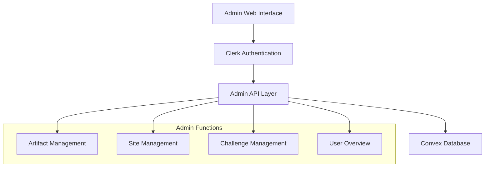

# Admin Content Management System Design

## Overview

The Admin Content Management System provides a simple, secure web interface for super administrators to manage content for the underwater archaeology games. The system extends the existing Clerk authentication and Convex backend with basic admin functionality for creating and managing game content.

The design focuses on essential content management features: adding artifacts, creating excavation sites, managing challenges, and basic user oversight. The system integrates with the existing Next.js application structure.

## Architecture

### High-Level Architecture



### Component Architecture

The system consists of these key components:

1. **Admin Interface**: Simple React pages for content management
2. **Authentication**: Clerk integration with admin role checking
3. **API Layer**: Convex mutations and queries for admin operations
4. **Data Layer**: Existing Convex schema with minimal admin extensions

## Components and Interfaces

### Authentication and Authorization

#### Simple Admin Role Check

- Use Clerk's existing user metadata to store admin role
- Check for `role: "admin"` in user metadata
- Protect admin routes with simple role validation

```typescript
interface AdminUser {
  clerkId: string;
  email: string;
  name: string;
  isAdmin: boolean;
}
```

### Content Management Interface

#### Artifact Management

- **Create Artifacts**: Form to add new artifacts with basic metadata
- **Edit Artifacts**: Update existing artifact information
- **Upload Images**: Simple file upload for artifact images
- **List Artifacts**: Table view of all artifacts with edit/delete actions

#### Excavation Site Management

- **Create Sites**: Form to define new excavation sites
- **Site Configuration**: Set grid dimensions, difficulty, and description
- **Artifact Placement**: Simple interface to assign artifacts to grid positions
- **List Sites**: Overview of all excavation sites

#### Challenge Management

- **Create Challenges**: Form to add new challenges and lessons
- **Content Editor**: Basic text editor for challenge descriptions
- **Difficulty Settings**: Set challenge difficulty and prerequisites
- **List Challenges**: Manage existing challenges

### User Management Interface

#### Student Overview

- **User List**: View all registered students
- **Progress Summary**: Basic progress and certification status
- **User Details**: View individual student information

## Data Models

### Minimal Schema Extensions

#### Admin Users (using Clerk metadata)

```typescript
// Stored in Clerk user metadata
{
  role: "admin" | "user",
  adminLevel: "super" // for future expansion
}
```

#### Simple Activity Log

```typescript
adminLogs: defineTable({
  adminClerkId: v.string(),
  action: v.string(), // "create_artifact", "update_site", etc.
  resourceType: v.string(),
  resourceId: v.optional(v.string()),
  timestamp: v.number(),
})
  .index("by_admin", ["adminClerkId"])
  .index("by_timestamp", ["timestamp"]);
```

### API Interfaces

#### Content Management APIs

```typescript
// Artifact Management
export const createArtifact = mutation({
  args: {
    name: v.string(),
    description: v.string(),
    historicalPeriod: v.string(),
    culture: v.string(),
    significance: v.string(),
    imageUrl: v.string(),
    difficulty: v.union(
      v.literal("beginner"),
      v.literal("intermediate"),
      v.literal("advanced")
    ),
    category: v.string(),
  },
  returns: v.id("gameArtifacts"),
  handler: async (ctx, args) => {
    // Simple admin check and create artifact
  },
});

// Site Management
export const createExcavationSite = mutation({
  args: {
    name: v.string(),
    location: v.string(),
    historicalPeriod: v.string(),
    description: v.string(),
    gridWidth: v.number(),
    gridHeight: v.number(),
    difficulty: v.union(
      v.literal("beginner"),
      v.literal("intermediate"),
      v.literal("advanced")
    ),
  },
  returns: v.id("excavationSites"),
  handler: async (ctx, args) => {
    // Simple admin check and create site
  },
});
```

## Error Handling

### Simple Error Management

- **Authentication Errors**: Redirect to login if not admin
- **Validation Errors**: Basic form validation with error messages
- **Database Errors**: Simple error messages for failed operations

## Testing Strategy

### Basic Testing

- **Unit Tests**: Test admin API functions with mock authentication
- **Integration Tests**: Test admin workflows with test database
- **Manual Testing**: Verify admin interface functionality

## Security Considerations

### Basic Security

- **Admin Role Check**: Verify admin role on all admin operations
- **Input Validation**: Basic validation of form inputs
- **Audit Trail**: Log admin actions for accountability
- **Secure Routes**: Protect admin pages with authentication middleware
